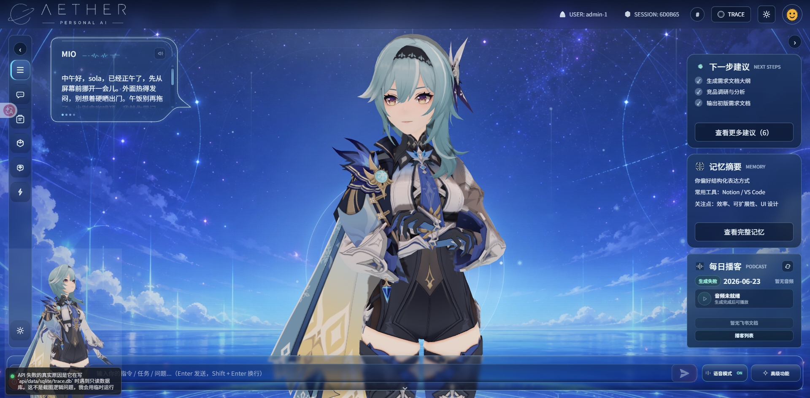
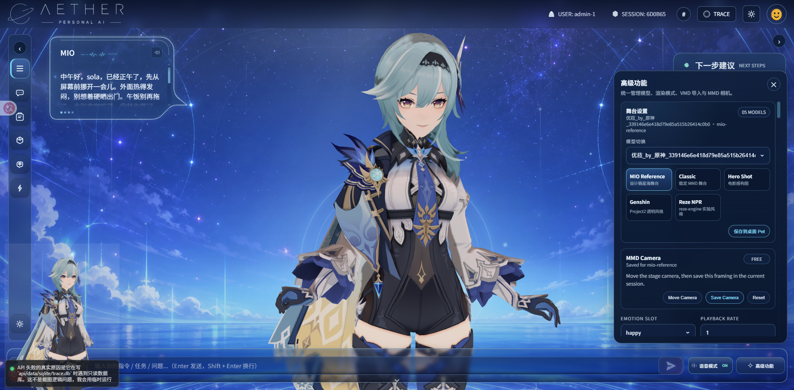

# OpenClaw MMD Companion

A reference implementation for OpenClaw-powered interactive MMD companion applications.

Browser-based MMD virtual companion with OpenClaw agent integration, trace logging, VMD interaction mapping, and API proxy.
基于浏览器的 MMD 虚拟陪伴项目，包含 OpenClaw 对话、交互映射和全链路 trace 日志。

## Repository Layout / 仓库结构

- `web/`: Next.js + TypeScript frontend; Next.js + TypeScript 前端
- `api/`: FastAPI backend proxy and trace gateway; FastAPI 后端代理与 trace 网关
- `MMD/`: local runtime-only PMX/PMD, texture, VMD, and audio assets; third-party assets are not redistributed by this repository
- `docs/plans/`: implementation planning docs; 实施计划文档
- `docs/architecture/trace-contract.md`: trace event contract; trace 事件协议文档

## Screenshots

The screenshots below show the interface with local MMD demo assets after the model has fully rendered. The referenced MMD character/model assets are treated as non-commercial, non-redistributable local demo materials; these screenshots do not grant commercial use, redistribution, or reuse rights for the underlying assets.





## License / Asset Policy

Source code and project documentation are licensed under the MIT License. See `LICENSE`.

The MIT license does not cover third-party MMD models, textures, toon files, SPA/SPH files, VMD motion packs, voice clips, music, screenshots, or other media placed under `MMD/`. `MMD/` is a local runtime asset directory. Local MMD assets used for demos should be treated as non-commercial and non-redistributable unless their original license explicitly says otherwise. Before publishing or sharing any assets there, verify the original author or game publisher terms; many MMD packages prohibit redistribution, commercial use, extraction of parts, or use outside MMD.

This repository should stay publishable without bundled third-party character/model/audio assets. Add your own legally usable local assets under `MMD/`, or point `MMD_ROOT_DIR` at another local directory.

## Core Features / 核心功能

- Browser MMD rendering with Three.js + MMDLoader; 基于 Three.js + MMDLoader 的浏览器 MMD 渲染
- Chat through backend proxy to OpenClaw with `/v1/responses` and fallback to `/v1/chat/completions`; 通过后端代理接入 OpenClaw，优先走 `/v1/responses`，必要时回退到 `/v1/chat/completions`
- Mixed text/JSON reply normalization into `text`, `emotion`, `action`, and `memory_ops`; 将文本或 JSON 回复统一归一化为 `text`、`emotion`、`action`、`memory_ops`
- Interaction chain of user mapping -> global mapping -> procedural fallback; 交互链路为用户映射 -> 全局映射 -> 过程化兜底
- VMD upload and binding for 6 emotion slots; 支持上传 VMD 并绑定到 6 个情绪槽位
- Full-chain trace logging across frontend and backend; 前后端全链路 trace 记录
- SQLite + NDJSON dual-write with retention cleanup; SQLite + NDJSON 双写并带保留期清理
- Browser and server TTS modes; 同时支持浏览器与服务端 TTS 模式

## MMD Model Loading / MMD 模型读取

The current app does not upload MMD models from the Advanced panel. Models are read by scanning the backend `MMD_ROOT_DIR` directory.
By default, `MMD_ROOT_DIR` is `MMD/` at the repository root. You can override it in `api/.env`:

```env
MMD_ROOT_DIR=MMD
```

Supported model files are `.pmx` and `.pmd`. The backend recursively scans the MMD root, so a model can be placed in any subfolder:

```text
MMD/
  Eula/
    Eula.pmx
    textures/
      body.png
      face.png
  OTs14/
    GirlsFrontline OTs14SSR0101.pmx
    Textures/
      ...
    spa/
      ...
```

Keep each model's textures, toon files, `.spa`, `.sph`, and other relative dependencies next to the model exactly as provided by the original MMD package. The browser loads the selected model through `GET /assets/mmd/{file_path}`, so broken relative paths inside the model package will usually show up as missing textures.

Frontend discovery flow:

- `GET /assets/mmd/models` lists all `.pmx/.pmd` files under `MMD_ROOT_DIR`.
- The Advanced panel's model selector uses that list directly.
- Selecting a model passes its `url` to the Three.js MMD stage.
- `GET /assets/mmd/validate?model_path=<relative_path>` can validate that a specific model file exists.

After adding or removing model files, refresh the web page or restart the API if the running process is using a stale filesystem view.

## Local Run / 本地运行

### 1. API / 后端

```powershell
cd api
copy .env.example .env
python -m uvicorn app.main:app --reload --port 8000
```

OpenClaw setup notes / OpenClaw 配置说明:

- Point `OPENCLAW_BASE_URL` at the Gateway HTTP port. The default local port is `http://127.0.0.1:18789`.  
  将 `OPENCLAW_BASE_URL` 指向 Gateway 的 HTTP 端口，默认本地端口为 `http://127.0.0.1:18789`。
- Enable `gateway.http.endpoints.responses.enabled=true` and/or `gateway.http.endpoints.chatCompletions.enabled=true` on the OpenClaw Gateway.  
  在 OpenClaw Gateway 中启用 `gateway.http.endpoints.responses.enabled=true` 和/或 `gateway.http.endpoints.chatCompletions.enabled=true`。
- Set `OPENCLAW_AGENT_ID` to the target agent. `OPENCLAW_MODEL` is treated only as a legacy local model selector; it is not forwarded as `x-openclaw-model`.  
  将 `OPENCLAW_AGENT_ID` 设为目标 agent。`OPENCLAW_MODEL` 仅作为旧版本地模型选择器保留，不会作为 `x-openclaw-model` 转发。
- Set `OPENCLAW_MESSAGE_CHANNEL=feishu` to route OpenClaw messages through the Feishu channel.  
  设置 `OPENCLAW_MESSAGE_CHANNEL=feishu`，让 OpenClaw 消息走飞书 channel。
- If Python cannot reach OpenClaw directly on this machine, set `OPENCLAW_PROXY_URL` such as `http://127.0.0.1:7897`.  
  如果当前机器上的 Python 进程无法直连 OpenClaw，请设置 `OPENCLAW_PROXY_URL`，例如 `http://127.0.0.1:7897`。
- Current OpenClaw `2026.3.28` deployments may require explicit `x-openclaw-scopes` on HTTP requests even when using the shared gateway bearer token. The backend sends this header automatically now.  
  当前 OpenClaw `2026.3.28` 版本在使用共享 gateway bearer token 时，HTTP 请求可能仍需要显式带上 `x-openclaw-scopes`。后端现已自动补上该 header。
- Use `GET /healthz/openclaw` to inspect live OpenClaw connectivity, read/write probes, and remediation hints.  
  可通过 `GET /healthz/openclaw` 查看实时 OpenClaw 连通性、读写探测结果和修复建议。

### 2. Web / 前端

```powershell
cd web
copy .env.example .env.local
npm install
npm run dev
```

Open `http://localhost:3000`.  
打开 `http://localhost:3000`。

## Verification / 验证

Use the bundled script:  
使用仓库自带脚本：

```powershell
powershell -File scripts/verify-demo.ps1
```

It currently validates:  
当前会验证：

- API test suite via `pytest`; 通过 `pytest` 运行 API 测试
- Web core logic checks via `node web/tests/run-basic-checks.mjs`; 通过 `node web/tests/run-basic-checks.mjs` 运行前端核心检查

## Dev Stack Script / 开发栈脚本

Use one script to manage both API and Web:  
使用同一个脚本同时管理 API 和 Web：

```powershell
# Start API(8100) + Web(3100)
powershell -File scripts/dev-stack.ps1 -Action start

# Check status
powershell -File scripts/dev-stack.ps1 -Action status

# Stop both processes
powershell -File scripts/dev-stack.ps1 -Action stop
```

Optional parameters / 可选参数:

```powershell
powershell -File scripts/dev-stack.ps1 -Action start -ApiPort 8200 -WebPort 3200 -AdminUserIds "admin-1,admin-2"
```

### WSL Mode / WSL 模式

Set `-RunEnv wsl` to launch the API and Web inside WSL instead of Windows. This is useful when Codex / Claude run inside WSL and you want the backend to share the same filesystem and process space.

使用 `-RunEnv wsl` 可以让 API 和 Web 在 WSL 内启动，而不是 Windows。当 Codex / Claude 跑在 WSL 内时，后端需要与它们共享文件系统和进程空间，此时应使用 WSL 模式。

```powershell
# WSL mode - API and Web start inside WSL via wsl.exe
powershell -File scripts/dev-stack.ps1 -Action start -RunEnv wsl

# Or via the wrapper script
.\\start-dev.ps1 -RunEnv wsl
```

What changes in WSL mode / WSL 模式下的区别:

- `CODEX_HOME`, `CODEX_WORKSPACE_*`, `CODEX_WORKTREE_ROOT` in `api/.env` are converted from Windows paths to WSL paths via `wslpath` (e.g. `C:\\Users\\KSG\\.codex` → `/mnt/c/Users/KSG/.codex`); `api/.env` 中的 `CODEX_HOME`、`CODEX_WORKSPACE_*`、`CODEX_WORKTREE_ROOT` 会从 Windows 路径自动转为 WSL 路径。
- uvicorn and Next.js start inside WSL using `python3` and `npm` from WSL; uvicorn 和 Next.js 在 WSL 内用 `python3` 和 `npm` 启动。
- Switching back to `-RunEnv win` auto-restores Windows-native paths in `api/.env`; 切回 `-RunEnv win` 时自动将 `api/.env` 中的 WSL 路径还原为 Windows 路径。
- WSL2 localhost forwarding lets Windows browsers and the desktop pet reach the services on `127.0.0.1` without extra config; WSL2 的 localhost 转发让 Windows 浏览器和桌面宠物通过 `127.0.0.1` 即可访问服务。

Prerequisites for WSL mode / WSL 模式前提条件:

```bash
# Inside WSL: install Python deps and Node.js if not already available
sudo apt install python3-pip
pip3 install -r api/requirements.txt

# Ensure npm is available (e.g. via nvm or system package)
# 确保 WSL 内有 npm（通过 nvm 或系统包安装）
```

## Portable Release Package / 便携 Release 包

仓库根目录的 start-mmd.ps1 是便携发布的唯一入口。默认 start 会先构建并组装 release/ 下带版本和时间戳的 ZIP 便携包，再从包内启动 API、Web production 和 Electron desktop-pet；这样启动路径与发布给其他机器的包内路径保持一致。

PowerShell 常用命令：

    .\start-mmd.ps1 -Action package
    .\start-mmd.ps1 -Action start
    .\start-mmd.ps1 -Action status
    .\start-mmd.ps1 -Action stop
    .\start-mmd.ps1 -Action kill

package 会生成 release/mmd-portable-<version>-<timestamp>/ 和同名 ZIP；start 会生成/刷新包后启动三端，默认 API 端口为 8200、Web 端口为 3200。进入已解压的包目录后，也可以直接执行包内的 .\start-mmd.ps1 -Action start|status|stop|kill；包内入口优先使用包内 manifest.json 和 scripts\release-stack.ps1，不会回到源码路径。

每个包包含 API 源码和 requirements.txt、Web production 产物及 Node 依赖、desktop-pet production renderer/Electron 产物及 Node 依赖、README-release.md 和可用的 MMD/MMD_stage 本地资源。当前不打包 Python 解释器或 API Python 依赖，因此目标机仍需已有 Python、Node.js/npm、Windows 图形环境，并按包内说明安装 API 依赖；这不是安装器，也不实现 NSIS。

打包器会排除 .git、源码 .runtime 历史、api/data 用户数据、无效 trace.db、测试临时文件和 desktop-pet-debug-events.ndjson。未显式设置 -ApiDataDir 或 API_DATA_DIR 时，包内无效/缺失的 api/data/sqlite/trace.db 会安全回退到包内 .runtime/release-stack/data；显式数据目录无效则严格失败。MMD 模型、贴图、动作和音频可能属于第三方，包中复制这些本地资源不代表取得再分发许可。

## Release Stack / 发布栈

发布栈通过仓库根目录的统一入口构建并启动 API、Web production server 和 Electron desktop-pet。默认使用 API `8200`、Web `3200`，与开发栈的 `8100`/`3100` 分离；Pet 不启动 Vite dev server，而是从 `desktop-pet/dist` 加载本地 renderer。

```powershell
# 构建 Web production bundle、Pet renderer/Electron，并检查 API 入口
powershell -File .\start-release.ps1 -Action build

# 构建后启动三端；省略 -SkipBuild 时 start 会先构建
powershell -File .\start-release.ps1 -Action start

# 查看 API/Web/Pet 进程、HTTP、renderer 文件和窗口 ready 状态
powershell -File .\start-release.ps1 -Action status

# 只停止本入口启动且身份匹配的进程；批次日志保留
powershell -File .\start-release.ps1 -Action stop

# 受控清理当前 Release 包残留进程和状态文件
powershell -File .\start-release.ps1 -Action kill
```

也可以使用 `start-release.cmd`。常用参数包括 `-ApiPort`、`-WebPort`、`-ApiHost`、`-WebHost`、`-ApiBaseUrl`、`-ApiDataDir`、`-UserId`、`-WorkspacePath`、`-SkipBuild` 和 `-PetReadyTimeoutSeconds`。省略 `-ApiBaseUrl` 时，Web/Pet 使用 API 端口生成的地址，也可继承已有 `MMD_PET_API_BASE_URL`。API 数据目录按以下规则解析：显式传入 `-ApiDataDir` 时严格使用该路径；未传入参数但存在非空 `API_DATA_DIR` 时严格使用环境变量路径；两者都未指定时，先检查 `api/data/sqlite/trace.db`，若文件缺失、是 Git LFS pointer 或不是可连接的 SQLite，则创建并使用 `.runtime/release-stack/data`，不会修改原文件。

Web 产物位于 `web/.next-codex-release`，Pet 产物至少包含 `desktop-pet/dist/index.html`、`menu.html`、`notification.html` 和 `dist-electron/main.js`。状态文件是 `.runtime/release-stack.json`，每次启动的 stdout/stderr 和 Pet ready marker 位于 `.runtime/release-stack/<批次>/`。只有显式的 `API_DATA_DIR` 或 `-ApiDataDir` 会严格拒绝无效数据库；省略两者时，默认 `api/data` 的 Git LFS pointer 会触发安全回退到 `.runtime/release-stack/data`。脚本不会覆盖、删除或修复原始 `api/data` 文件。

`start` 按 API、Web、Pet 三个组件分别对账：当前包中进程身份匹配且健康的组件会标记为 `reused` 并直接复用，缺失、不健康或身份不匹配的组件才会启动；状态文件缺失或只记录部分组件时，只要能由当前包路径、命令身份、端口父进程树和 Pet ready marker 安全证明归属，也会采纳并写回状态。端口被其它 Release 包或其它命令占用时不会复用，也不会被 `kill`，启动会报告冲突并停止继续操作。`kill` 只清理能由状态记录或同样的当前包身份证明确认属于本包的 API/Web/Pet 进程树，并删除本包状态/ready 文件；不会按端口、进程名或 PID 泛杀。

## API Endpoints (MVP) / API 接口（MVP）

- `POST /chat`
- `GET /trace/events`
- `GET /trace/mirrors`
- `GET|PUT /config/mapping/default`
- `GET|PUT /config/mapping/user/{user_id}`
- `GET /config/mapping/resolved/{user_id}`
- `POST|GET /assets/vmd`
- `DELETE /assets/vmd/{asset_id}`
- `GET /assets/vmd/file/{asset_id}`
- `GET /assets/mmd/models`
- `GET /assets/mmd/validate`
- `GET /assets/mmd/{file_path}`
- `POST /tts/speak`
- `GET /healthz`
- `GET /healthz/openclaw`
