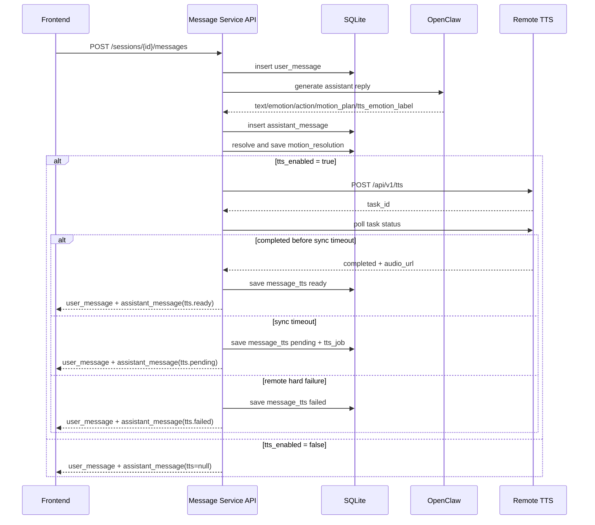
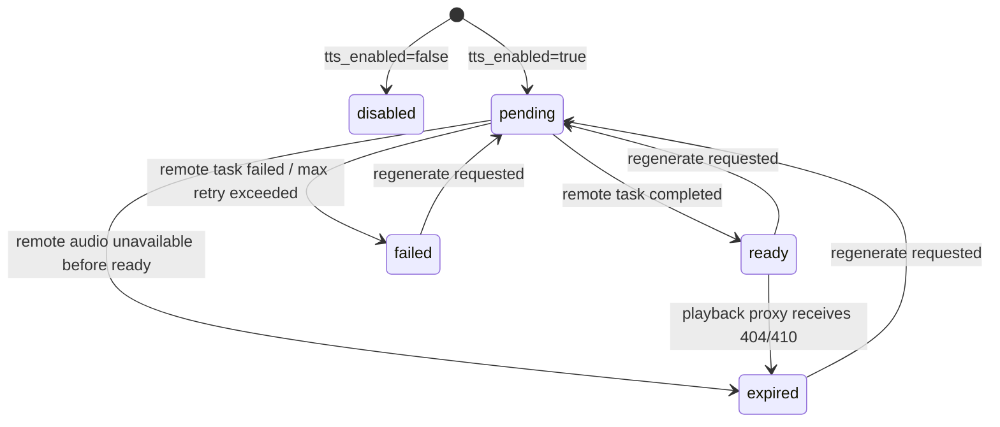
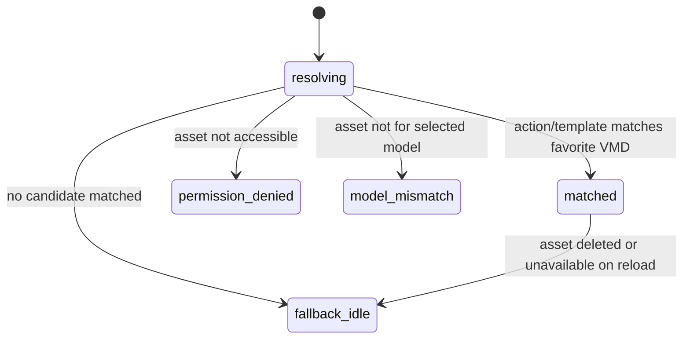

# 消息通讯服务 v2 设计规格

日期：2026-05-08

## 1. 背景

当前 Companion 聊天链路分散在前端 React state、`POST /chat`、`POST /tts/speak`、trace、VMD resolver 等多个位置。前端负责拼接聊天、TTS、动作播放和临时消息状态，导致刷新后消息与语音不可完整还原，也难以做账号/角色隔离。

消息通讯服务 v2 的目标是把聊天、TTS 引用、动作解析、会话恢复和权限校验收束到后端统一编排层。OpenClaw 仍然是日常聊天中枢，负责生成回复、动作意图、TTS 情绪建议和长期记忆能力；本项目后端 SQLite 作为应用侧权威消息账本，负责 session、messages、TTS 远端引用、motion resolution、trace 关联和权限隔离。

## 2. 目标

- 后端提供权威 session/message 持久化，页面刷新后可恢复会话列表、当前消息、人物气泡和 TTS 播放按钮。
- 前端发送消息只调用统一 v2 接口，由后端完成 OpenClaw、TTS、VMD 解析和持久化编排。
- TTS 音频不在当前服务端落盘，只保存远端音频引用地址。
- 播放优先直连远端音频地址，失败后 fallback 到当前 API proxy；proxy 只转发，不落盘。
- 底层按 workspace/account 设计权限隔离，首版 UI 仍表现为个人会话。
- 支持 VMD 收藏动作上下文导出给 OpenClaw，OpenClaw 返回动作名称，后端本地解析并保存 resolution。
- 旧接口保留但标记 deprecated，作为兼容和回滚路径。

## 3. 非目标

- 首版不实现正式登录/JWT/密码系统，继续使用 `x-user-id`。
- 首版不实现多人 workspace UI、邀请、成员管理。
- 首版不实现本地长期记忆表；`memory_ops` 只记录，不执行。
- 首版不自动把 VMD 动作上下文写入 OpenClaw，由用户复制到 OpenClaw。
- 首版不保存 TTS 音频文件内容。
- 首版不实现 TTS 多版本播放 UI。
- 首版不实现 SSE，只预留事件模型。

## 4. 架构原则

OpenClaw 是智能中枢，本地 SQLite 是应用账本。OpenClaw 负责生成：

- `text`
- `emotion`
- `action`
- `motion_plan`
- `tts_emotion_label`
- `tts_pause_profile`
- `memory_ops`

本地消息服务负责：

- 创建和恢复 workspace/session/messages。
- 保存 OpenClaw 原始规范化输出。
- 按当前用户、当前模型、收藏 VMD 解析动作。
- 按需生成 TTS，并保存远端音频引用。
- 管理 TTS job、proxy fallback、过期标记和重新生成。
- 做权限隔离和 trace 记录。

每个 session 独立 `openclaw_session_key`。跨会话长期记忆交给 OpenClaw 自身 memory/tool 或后续独立 memory service，不让不同 session 的历史直接混在一起。

## 5. 状态机

### 5.1 消息发送总流程



### 5.2 TTS 状态机



说明：

- 消息本体不因 TTS 失败而回滚。
- 同步等待只等到 `TTS_SYNC_WAIT_SECONDS`。
- 超时返回 `pending`，后台 SQLite job worker 继续处理。
- 只有 proxy 明确收到远端 404/410，才标记 `expired`。
- 普通网络失败、CORS、临时连接错误不直接判定为过期。

### 5.3 VMD 解析状态机



## 6. 数据模型

### 6.1 accounts

```txt
id
external_user_id
display_name
created_at
updated_at
```

### 6.2 workspaces

```txt
id
name
kind: personal | shared
owner_account_id
created_at
updated_at
```

### 6.3 workspace_members

```txt
workspace_id
account_id
role: owner | admin | member | viewer
created_at
```

### 6.4 sessions

```txt
id
workspace_id
account_id
openclaw_session_key
title
title_source: default | user_first_message | manual | generated
selected_model_path
created_at
updated_at
deleted_at nullable
```

标题策略：

- 新 session 初始标题为“新对话”。
- 第一条用户消息发送后，用用户消息截断生成标题。
- 保留 `title_source = generated` 给未来后台标题生成。
- 用户手动重命名后 `title_source = manual`，后台生成不能覆盖。

### 6.5 messages

```txt
id
workspace_id
session_id
account_id
role: user | assistant | system
content
trace_id
openclaw_message_id nullable
emotion nullable
action nullable
tts_emotion_label nullable
tts_pause_profile nullable
motion_plan_json nullable
memory_ops_json nullable
metadata_json nullable
created_at
deleted_at nullable
```

`messages` 保存 OpenClaw/response parser 的原始规范化输出。`memory_ops_json` 首版只记录，不执行。

### 6.6 message_tts

```txt
id
workspace_id
message_id
provider: voice-workflow
version
status: pending | ready | failed | expired
task_id
remote_audio_url
remote_audio_path
media_type
duration_seconds
chunks_count
error
created_at
completed_at
expires_at nullable
updated_at
```

首版一条 message 只使用一个 active TTS 记录。重新生成时覆盖当前引用并递增 `version`，不提供多版本播放 UI。

### 6.7 tts_jobs

```txt
id
workspace_id
message_id
message_tts_id
status: pending | running | completed | failed | cancelled
attempts
next_attempt_at
locked_at
last_error
created_at
updated_at
```

TTS job 使用 SQLite 队列。服务重启后 worker 扫描 `pending/running` 且锁过期的 job 继续处理。

### 6.8 message_motion_resolution

```txt
id
workspace_id
message_id
selected_model_path
source_action
source_template
resolved_asset_id
resolved_asset_url
resolved_display_name
status: matched | fallback_idle | missing_asset | permission_denied | model_mismatch
fallback_reason
created_at
```

保存 OpenClaw 动作意图和本地 VMD 解析结果。前端恢复时优先使用 resolution；如果 asset 已删除、无权限或模型不匹配，则 fallback idle。

### 6.9 motion_context_exports

```txt
id
workspace_id
account_id
model_key
model_display_name
export_json
motion_count
created_at
```

保存当前用户当前模型最近一次 VMD 动作上下文导出快照。首版按个人收藏导出，保留 `workspace_id` 便于未来共享。

## 7. 权限模型

首版继续使用：

```txt
x-user-id: <external_user_id>
```

后端统一 `resolve_account()`：

1. 根据 `external_user_id` 查找 account。
2. 不存在则自动创建 account。
3. 不存在 personal workspace 则自动创建 workspace。
4. 自动写入 `workspace_members(role=owner)`。

所有 v2 查询必须基于：

```txt
workspace_id + account_id membership
```

首版角色：

```txt
owner  : personal workspace 拥有者
admin  : 预留共享 workspace 管理
member : 预留普通成员
viewer : 预留只读
```

`ADMIN_USER_IDS` 保留为运维后门，用于配置、诊断、全局 trace 查看。普通 session/message 访问仍优先走 workspace membership。

## 8. API 契约

### 8.1 Workspace

```txt
GET /workspaces/current
```

返回当前 account 的 personal workspace；不存在则创建。

### 8.2 Sessions

```txt
GET    /sessions
POST   /sessions
GET    /sessions/{session_id}
PATCH  /sessions/{session_id}
DELETE /sessions/{session_id}
```

`DELETE` 首版软删除，写 `deleted_at`。

### 8.3 Messages

```txt
GET  /sessions/{session_id}/messages
POST /sessions/{session_id}/messages
GET  /messages/{message_id}
```

发送请求：

```json
{
  "content": "你好",
  "tts_enabled": true,
  "selected_model_path": "优菈.pmx"
}
```

发送响应：

```json
{
  "session": {
    "id": "sess_...",
    "title": "你好",
    "updated_at": "2026-05-08T10:00:00Z"
  },
  "user_message": {
    "id": "msg_user_...",
    "role": "user",
    "content": "你好",
    "created_at": "2026-05-08T10:00:00Z"
  },
  "assistant_message": {
    "id": "msg_assistant_...",
    "role": "assistant",
    "content": "欢迎回来。",
    "emotion": "happy",
    "action": "asset_...",
    "tts_emotion_label": "关心温柔",
    "tts_pause_profile": "podcast",
    "motion_plan": {
      "sequence": []
    },
    "motion_resolution": {
      "status": "matched",
      "resolved_asset_id": "asset_...",
      "resolved_asset_url": "/assets/vmd/file/asset_...",
      "source_action": "asset_..."
    },
    "tts": {
      "id": "tts_...",
      "status": "ready",
      "provider": "voice-workflow",
      "task_id": "remote-task-id",
      "remote_audio_url": "http://10.11.252.164:5555/api/v1/audio/...",
      "proxy_audio_url": "/tts/proxy/tts_...",
      "media_type": "audio/wav",
      "duration_seconds": 3.2,
      "version": 1
    },
    "created_at": "2026-05-08T10:00:01Z"
  }
}
```

### 8.4 TTS

```txt
POST /messages/{message_id}/tts/regenerate
POST /message-tts/{tts_id}/mark-expired
GET  /tts/proxy/{tts_id}
```

重新生成请求首版 UI 传空对象：

```json
{}
```

接口预留 override：

```json
{
  "tts_emotion_label": "关心温柔",
  "tts_pause_profile": "none"
}
```

### 8.5 Motion Context

```txt
POST /motion-context/exports
GET  /motion-context/exports/latest?model_key=...
```

导出请求：

```json
{
  "selected_model_path": "优菈.pmx"
}
```

### 8.6 Deprecated

旧接口保留但 deprecated：

```txt
POST /chat
POST /tts/speak
```

旧接口不再追加新功能。可在响应头添加：

```txt
Deprecation: true
```

## 9. TTS 细节

远端 TTS 原生枚举：

```txt
日常平静
轻微傲气
调侃玩笑
关心温柔
委屈低落
认真坚定
战斗激昂
```

OpenClaw 可返回：

```json
{
  "tts_emotion_label": "关心温柔",
  "tts_pause_profile": "podcast"
}
```

后端规则：

- `tts_emotion_label` 合法时传给远端。
- 缺失时不传，让远端自动分析，并写 trace warning。
- 非法时不传，保存原始值到 `metadata_json`，并写 trace warning。
- `tts_pause_profile` 只接受 `podcast | none`。
- 缺失或非法时使用 `podcast`，并写 trace warning。

缺失 emotion warning 示例：

```json
{
  "stage": "tts.prepare",
  "status": "warning",
  "payload": {
    "reason": "missing_tts_emotion_label",
    "fallback": "remote_auto_analysis"
  }
}
```

同步等待策略：

- 配置 `TTS_SYNC_WAIT_SECONDS`。
- 上限内 completed：返回 `tts.ready`。
- 超时：返回 `tts.pending`，写 SQLite job 后台继续。
- 远端 hard failure：返回 `tts.failed`，消息本体仍保存。

过期策略：

- 前端播放先直连远端 URL。
- 直连失败后使用 `/tts/proxy/{tts_id}`。
- proxy 远端返回 404/410 时，后端标记 `expired`。
- 其他错误只记录 playback failure，不直接标记 expired。

## 10. VMD Motion Context 与动作解析

高级面板 Favorites 区域提供“导出 VMD 动作上下文”按钮。首版按当前用户个人收藏生成，过滤当前 selected model 的 favorite VMD。

导出 JSON 示例：

```json
{
  "schema": "mmd.favorite_motions.v1",
  "model": {
    "model_key": "优菈.pmx",
    "display_name": "优菈"
  },
  "motions": [
    {
      "motion_key": "asset_8f3a21",
      "asset_id": "asset_8f3a21",
      "display_name": "打招呼1",
      "filename": "打招呼1.vmd",
      "source_name": "打招呼1",
      "match_names": ["asset_8f3a21", "打招呼1", "打招呼1.vmd"],
      "emotion": "happy",
      "action": "asset_8f3a21",
      "safe_for_chat": true
    }
  ],
  "fallback": {
    "action": "idle",
    "description": "如果没有合适动作，返回 idle 或 neutral，前端会播放默认待机动作。"
  },
  "instruction": "回复时优先把 action 设置为 motion_key。"
}
```

匹配规则：

```txt
候选来源优先级：
1. assistant.action
2. motion_plan.sequence[0].template
3. motion_plan.sequence 后续 template，预留给未来多段动作
4. fallback idle

匹配字段优先级：
1. asset_id / motion_key
2. display_name
3. filename 去 .vmd
4. source_name
5. aliases（未来）
6. fallback idle
```

首版 `motion_key = asset_id`。名字字段用于 OpenClaw 理解和兜底匹配。aliases、description 可以在表结构中预留，首版不要求编辑器。

## 11. 前端恢复与预载

页面加载流程：

```txt
1. resolve current user
2. load current personal workspace
3. load session list
4. pick active session:
   - URL session_id
   - localStorage last_active_session_id
   - latest updated session
   - none -> create session
5. load messages
6. latest assistant message drives character bubble
7. TTS metadata restores voice buttons
```

TTS UI：

- `ready`：显示可播放按钮。
- `pending`：显示 loading/disabled，启动轻量轮询。
- `failed`：显示不可用，可提供重新生成。
- `expired`：显示已过期，可提供重新生成。

预载策略：

- 只对最新 assistant 且 `tts.status=ready` 的音频执行 `preload="metadata"`。
- 不预载历史消息完整音频。
- metadata 预载失败不立即标记 expired。
- 点击播放仍按直连到 proxy fallback 判断。

pending 轮询：

```txt
GET /messages/{message_id}
```

停止条件：

- `tts.status = ready`
- `tts.status = failed`
- `tts.status = expired`
- 前端最大等待时间到达

预留 SSE：

```txt
GET /sessions/{session_id}/events
event: message.updated
event: tts.updated
event: session.updated
```

## 12. 清理策略

默认不自动删除 session/messages。后台清理能力提供：

- 清理软删除 session 的 messages/tts 元数据。
- 清理超过 N 天的 `expired/failed` TTS 记录。
- 清理孤儿 TTS job。
- 清理长期 pending 且超过最大重试次数的 job。
- trace 清理沿用现有 retention。

远端音频过期时：

- 不删除消息。
- `message_tts.status = expired`。
- 保留 `remote_audio_url` 作为历史引用。
- 前端显示可重新生成。

## 13. 实施阶段

### Phase 1：后端消息账本基础

- 新增 account/workspace/session/message 表。
- 新增 store 方法。
- 实现：
  - `GET /workspaces/current`
  - `GET /sessions`
  - `POST /sessions`
  - `PATCH /sessions/{id}`
  - `DELETE /sessions/{id}`
  - `GET /sessions/{id}/messages`
- 旧 `/chat` 不动。

### Phase 2：统一发送接口

- 实现 `POST /sessions/{id}/messages`。
- 保存 user message。
- 调用 OpenClaw。
- 规范化 assistant message。
- 保存 `emotion/action/motion_plan/memory_ops/tts_emotion_label/tts_pause_profile`。
- 返回 user message + assistant message。
- 此阶段可以先不生成 TTS。

### Phase 3：TTS 引用持久化与 job

- 接入远端 TTS。
- 新增 `message_tts` 和 `tts_jobs`。
- 同步等待上限内 ready。
- 超时返回 pending，后台 worker 继续。
- 实现：
  - `GET /messages/{id}`
  - `POST /messages/{id}/tts/regenerate`
  - `GET /tts/proxy/{tts_id}`
- 实现过期标记。

### Phase 4：前端迁移

- Companion 页面加载 session list/current messages。
- 发送改用 v2。
- Chatbox 和人物气泡由后端 message 恢复。
- TTS ready/pending/expired 状态驱动播放按钮。
- 最新 assistant metadata 预载。
- pending TTS 轮询恢复。

### Phase 5：VMD motion context 与 resolution

- 高级面板 Favorites 增加导出 JSON。
- 保存最近导出快照。
- 后端根据 action 优先解析 favorite VMD。
- 保存 `message_motion_resolution`。
- 前端优先使用 resolution，失败 fallback idle。
- 旧接口标记 deprecated，测试补齐。

## 14. 测试计划

### API 单测

- `resolve_account()` 自动创建 account/personal workspace/member。
- workspace membership 隔离。
- session CRUD 和软删除。
- message list 只返回有权限的数据。
- `POST /sessions/{id}/messages` 返回 user+assistant message。
- OpenClaw fallback 不丢失 user message。
- TTS ready 路径保存 remote URL。
- TTS timeout 返回 pending 并创建 job。
- TTS job 完成后更新 message_tts。
- proxy 404/410 标记 expired。
- regenerate 覆盖当前 TTS 引用并递增 version。
- motion resolution matched/fallback/model_mismatch。
- deprecated 旧接口仍可用。

### 前端检查

- 页面加载 session list 和当前 messages。
- 最新 assistant 驱动物气泡。
- TTS ready 显示播放按钮。
- TTS pending 显示 loading/disabled 并轮询。
- 最新 assistant metadata preload。
- 直连失败 fallback proxy。
- 发送响应用后端 user_message id 替换乐观消息。

### 集成测试

- `tts_enabled=true` 且远端快速完成：一次响应返回 `tts.ready`。
- `tts_enabled=true` 且同步超时：一次响应返回 `tts.pending`，后续轮询恢复 ready。
- 远端音频过期：proxy 返回 404 后 message_tts 变 expired。
- VMD 导出 JSON 后，OpenClaw 返回 `motion_key` 能解析到收藏 VMD。

